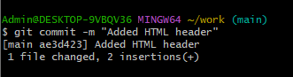
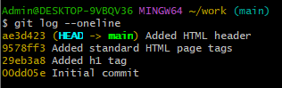
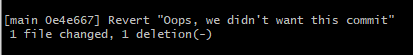
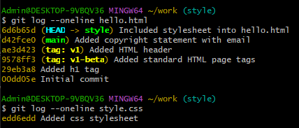
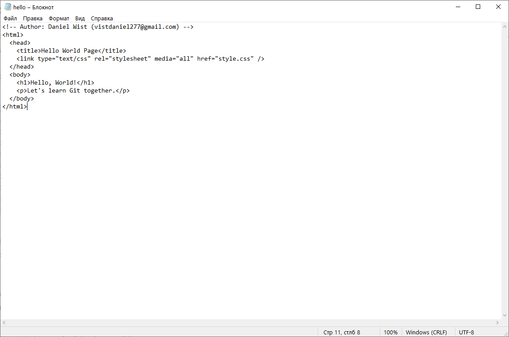

# Git

  

 Вказуємо ім'я та пошту для подальшої роботи    

  

 Налаштовуємо main як гілку за замовчуванням    

  

 Також налаштовуємо обробку кінців рядків (в нашому випадку для Windows)    

  

 Створюємо каталог work та файл hello.html в ньому    

  

 Вміст файлу hello.html - "Hello, World!"    

  

 Тепер створюємо репозиторій Гіт із цього каталогу    

  

 Додамо файл hello.html до нашого репозиторію    

  

 Перевіримо поточний статус репозиторію    

  

 Трохи змінимо файл hello.html - додамо html-тег "h1"    

  

 Знову перевіримо статус репозиторію - як ми бачимо файл було змінено, але ці зміни ще не зафіксовано в репозиторії    

  

 Тепер ще раз додамо файл hello.html до репозиторію та перевіримо статус    

  

 За допомогою команди commit відкриємо редактор    

  

 Після збереження файлу, виходу з редактора та ще одної перевірки статуса ми побачимо наступне:    

  

 Додамо до файлу hello.html теги "html" та "body"    

  

 Збережемо зміни в файлі командою add    

  

 Додамо до файлу hello.html також тег "head"    

  

 Перевіримо поточний статус    

  

 Зафіксуємо зміни та перевіримо статус    

  

 Додамо зміни до робочої області командою git add . та знову перевіримо статус    

  

 Зафіксуємо останні зміни    

  

 Отримуємо список внесених змін з командою git log --oneline (я обрав саме такий формат виводу історії, далі буде використовуватись саме він)    

  

 Найбільш підходящий формат виводу змін на думку автора гайду    

  

 Переглянемо хеш одного з чекаутів    

  

 Повертаємось назад до основної гілки main та перевіряємо вміст файлу hello.html    

  

 Додаємо тег "v1" до нинішньої версії сторінки    

  

 Перевіримо версію v1 та файл hello.html - як бачимо, файл в цій версії містить html теги "html" та "body", але ще не містить "head"    

  

 Позначимо цю версію тегом "v1-beta"    

  

 Подивимось різницю між цими двома версіями за допомогою checkout    

  

 Також можна подивитись доступні теги за допомогою команди tag    

  

 І за допомогою команди log    

  

 Перемикаємось назад на головну гілку main    

  

 Додамо непотрібний коментар до нашого файлу hello.html    

  

 Перевіримо статус директорії - файл було змінено, але ці зміни ще не зафіксовано    

  

 Перевіримо версію файлу hello.html в самому репозиторії - немає ні змін в файлі, ні непотрібного коментаря    

  

 Додамо ще раз непотрібний коментар до файлу hello.html    

  

 Зафіксуємо зміни в файлі та переглянемо статус    

  

 За допомогою команди reset HEAD очищаємо проміжну область від змін, які ми щойно внесли.    

  

 Перевіряємо версію файлу hello.html і знову прибираємо непотрібні нам зміни в директорії    

  

 І ще раз додамо непотрібний коментар до файлу hello.html    

  

 Збережемо зміни в файлі командою add та додамо комміт з назвою "Oops, we didn't want this commit"    

  

 Аби відмінити комміт, прописуємо команду revert HEAD і заходимо в редактор, де залишаємо все без змін    

  

 Перевіряємо лог, який показує небажані скасування та фіксації в нашому репозиторії.    

  

 Позначимо останній комміт тегом "oops", щоб ми могли знайти його після видалення комміту(ів)    

  

 За допомогою параметру "--hard" змушуємо робочий каталог відображати нову "голову" гілки    

  

 За допомогою команди "log --all" можна переглядати абсолютно всі комміти репозиторію, навіть ті, які були прибрані з головної гілки main    

  

 Аби видалити помічені тегом комміти і сам тег, використовуємо "tag -d"    

  

 Додамо авторський коментар до файлу hello.html    

  

 Зафіксуємо зміни, додамо комміт "Added copyright statement" та перевіримо лог    

  

 Також додамо до авторського коментаря в файлі hello.html пошту    

  

 Знову зафіксуємо зміни та додамо комміт "Added copyright statement with email"    

  

 Перевіримо лог - новий комміт «автор/електронна пошта» замінив оригінальний комміт «автор».    

  

 Створимо нову гілку з назвою "style" та одразу перевіримо її статус    

  

 Створимо простенький css файл під назвою style.css    

  

 Зафіксуємо зміни та додамо комміт "Added css stylesheet"    

  

 Підключимо css до файлу hello.html    

  

 Знову зафіксуємо зміни та додамо комміт "Included stylesheet into hello.html"    

  

 Перевіримо всі логи - тепер наш проект має дві гілки: main та style    

  

 Повернемося назад до основної гілки і перевіримо вміст файлу hello.html - немає жодних слідів файлу style.css, бо ми не можемо побачити його з головної гілки    

  

 Аби в цьому переконатись повернемось назад до гілки style та знову перевіримо вміст файлу hello.html - зміни, пов'язані з css-файлом, присутні    

  

 Подивимось на лог змін файлів hello.html та style.css    

  

 Розглянемо зміни у файлі hello.html у комміті з тегом "v1"    

  

 Перейменуємо файл hello.html на index.html командою mv та перевіримо статус    

  

 Зафіксуємо зміни в усій гілці та знову переглянемо статус    

  

 Створимо окрему папку для файлу style.css, зафіксуємо його переміщення туди та перевіримо статус    

  

 Додамо комміт "Renamed hello.html; moved style.css" та переглянемо обидві версії історії файлу css/style.css - звичайну і до його переміщення за допомогою параметру "--follow"    

  

 Повернемось назад до головної гілки main, створимо файл README за допомогою команди touch та заповнимо його потрібним вмістом, зафіксуємо зміни та додамо комміт "Added README"    

  

 Такий вигляд має файл README    

  

 Переглянемо вміст всіх гілок командою "log --all --graph", де параметр "--all" гарантує, що ми бачимо всі гілки, а параметр "--graph" додає просте дерево комітів, представлене основними рядками тексту    

  

 Повертаємось до гілки style, де об'єднаємо її з гілкою main командою "merge" та перевіримо графіки фіксації    

  

 Повертаємось до головної гілки main та змінюємо файл hello.html - додаємо заголовок та абзац    

  

 Фіксуємо зміни та додаємо комміт "Added meta title"    

  

 Переглядаємо вміст всіх гілок    

  

 Змінимо гілку на style,  об'єднаємо останні зміни в ній з гілкою main та перевіримо статус    

  

 При відкритті файлу hello.html можимо бачити, що секція між кутовими дужками представляє конфлікт    

  

 Аби це виправити, перервемо злиття та повернемося назад до стану до злиття за допомогою команди "merge --abort"    

  

 Змінимо вигляд файлу hello.html до такого вигляду:    

  

 Зафіксуємо зміни, додамо комміт "Resolved merge conflict", перевіримо статус та вміст всіх гілок    

  

 Тепер знову попрацюємо з гілкою style - перевіримо її вміст та скинемо її до комміту "Renamed hello.html; moved style.css", який відбувся 2 коміти тому, для цього використовуємо команду "reset --hard HEAD~2"    

  

 Знову перевіряємо вміст гілки style    

  

 Тепер спробуємо замість об'єдання гілок перемістити зміни до гілки style - використовуємо команду "rebase" та перевіряємо статус    

  

 Знову маємо конфлікт, але цього разу в файлі hello.html, оскільки цей файл ще не перейменовано в гілці main, тому він все ще має стару назву.    

  

 Змінюємо файл hello.html до наступного вигляду:    

  

 Фіксуємо зміни, залишаємо в редакторі все без змін, перевіряємо статус та вміст всіх гілок    

  

 Повертаємось до гілки main та пробуємо об'єднати її з гілкою style    

  

 Перевіряємо вміст всіх гілок - тепер гілки main та style ідентичні    

  

 Виходимо до головної папки репозиторію repositories, де міститься папка work з усіма файлами    

  

 Створюємо клон work, назвавши його home    

  

 Подивимось вміст клонованого репозиторію - можна побачити файли README, index.html та css з оригінального репозиторію    

  

 Переглянемо вміст історії клонованого репозиторію - все збігається з оригіналом    

  

 Переглянемо інформацію про назву оригінального репозиторію командами "remote" та "remote show origin"    

  

 Переглянемо які гілки є в клонованому репозиторії - бачимо тільки основну main, але оскільки команда "branch" за замовчуванням показує лише локальні гілки, то командою "branch -a" подивимось усі гілки    

  

 Змінюємо файл README наступним чином:    

  

 Повертаємось назад до оригінального репозиторію work, фіксуємо зміни файлу README та додаємо комміт "Changed README in original repo"    

  

 Повернемось до клонованого репозиторію home, де пропишемо команду "fetch", яка отримуватиме нові комміти з віддаленого репозиторію, але не об’єднуватиме їх у локальні гілки, також преевіримо вміст всіх гілок     

  

 Перевіримо вміст файлу README - нічого не змінилось    

  

 Об'єднаємо отримані зміни в локальну гілку main    

  

 Знову перевіримо вміст файлу README - тепер бачимо зміни    

  

 Команда "pull" виконує ті ж самі функції, що й попередні дві команди: "fetch" та "merge"    

  

 Додаємо до цього репозиторію гілку style з оригінального командою "branch --track style origin/style" та переглядаємо всі гілки - style тепер присутня    

  

 Знову виходимо до головної папки репозиторію repositories і створимо "голе" сховище - те, що немає робочого каталогу за допомогою команди "clone --bare work work.git" і переглянемо його вміст    

  

 Додамо репозиторій work.git до нашого оригінального репозиторію work    

  

 Змінимо файл README наступним чином:    

  

 Повертаємось до основної гілки main, фіксуємо зміни файлу README, додаємо комміт "Added shared comment to readme" та відправляємо ці зміни до спільного репозиторію work.git    

  

 Повертаємось до клонованого репозиторію home, де отримуємо зміни зі спільного середовища work.git командами "remote add shared ../work.git", "branch --track shared main" та "pull shared main", після чого переглядаємо вміст файлу README    

  

 Для того, аби розмістити Git-репозиторій на GitHub, можна використовувати команду "git daemon --verbose --export-all --base-path=." і посилання на папку з репозиторіями. Після цього перейти в інший термінал в ту саму папку і виконати команди "clone git://localhost/work.git network_work", "cd network_work" та "ls", після чого можна буде побачити копію проєкту   

